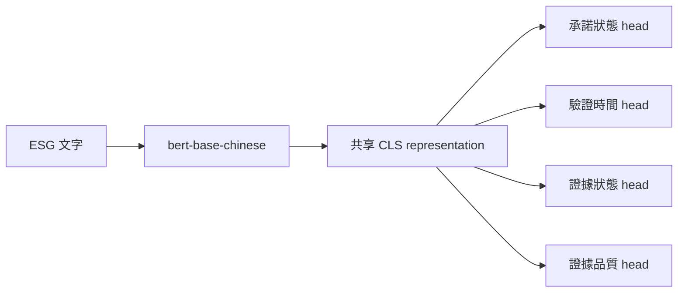

# ESG 承諾與證據品質多任務 BERT 分類

以 Chinese BERT 共用文字 encoder，搭配四個分類 head，同時判斷企業 ESG 陳述的承諾狀態、驗證時間、證據狀態與證據品質。加權版本使用 class-weighted cross entropy 與 early stopping 緩解類別不平衡。

## 架構



## 驗證結果

| 任務 | Macro-F1 | 權重 |
|---|---:|---:|
| 承諾狀態 | 0.724 | 0.20 |
| 驗證時間 | 0.434 | 0.15 |
| 證據狀態 | 0.589 | 0.30 |
| 證據品質 | 0.469 | 0.35 |
| **加權總分** | **0.5507** | — |

最佳 epoch 為 5。完整 classification report 與圖表位於 `results/`。

## 執行

```bash
python -m venv .venv
pip install -r requirements.txt
python src/train_weighted.py
```

程式會從資料集官方 GitHub 的固定 commit 下載訓練 JSON；如已下載，也可將檔案放在執行目錄。

## 限制與誠實揭露

資料高度不平衡；驗證集中 `verification_timeline/within_2_years` 僅 1 筆，而 `evidence_quality/Misleading` 為 0 筆，因此對稀有類別的 macro-F1 很不穩定，不能把目前結果解讀成穩健的部署表現。409 MB 的模型權重與 validation 原文預測未提交。
